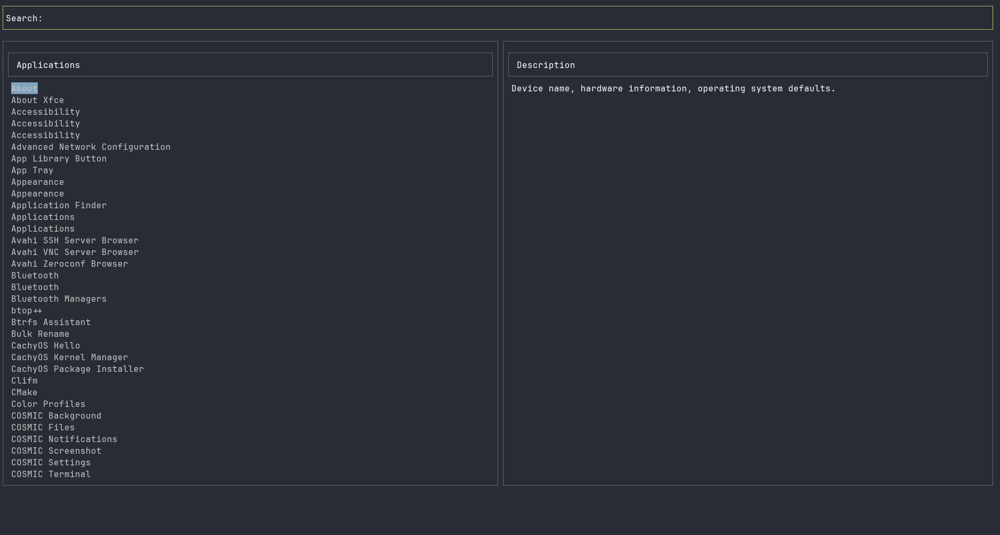

# GeekyMenu

A fast, fuzzy-search application launcher for Linux with a terminal-based UI. Quickly find and launch applications from your system's `.desktop` files. Perfect for window managers that need a lightweight application launcher.

## Features

- 🔍 **Fuzzy Search**: Type to instantly filter applications
- ⚡ **Fast Navigation**: Use arrow keys to browse results
- 📱 **Terminal UI**: Beautiful blessed-based interface
- 🚀 **Quick Launch**: Press Enter to launch applications
- 📂 **Auto-discovery**: Scans system application directories

## Screenshots

The launcher provides a split-pane interface:
- **Top**: Search input field
- **Left**: Filtered application list
- **Right**: Application description preview




## Installation

### Prerequisites

- Node.js 18+ 
- npm or yarn

### Global Installation (Recommended)

Install GeekyMenu globally to use it as a command from anywhere:

```bash
# Clone the repository
git clone <your-repo-url>
cd geekymenu

# Install globally
npm install -g .

# Now you can run it from anywhere
geekymenu
```

### Local Development

For development or testing:

```bash
# Clone the repository
git clone <your-repo-url>
cd geekymenu

# Install dependencies
npm install

# Run locally
npm start
# or
node geekymenu.js
```

## Usage

### Running the Launcher

```bash
# If installed globally
geekymenu

# If running locally
node geekymenu.js

# For window managers, use with terminal emulator
terminal -e geekymenu
```

### Controls

- **Type**: Start typing to filter applications
- **↑/↓**: Navigate through results
- **Page Up/Page Down**: Jump by 10 items
- **Enter**: Launch selected application
- **Escape**: Exit the launcher
- **Ctrl+C**: Force quit

### Keyboard Shortcuts

| Key | Action |
|-----|--------|
| `↑` | Move up in list |
| `↓` | Move down in list |
| `Page Up` | Jump up 10 items |
| `Page Down` | Jump down 10 items |
| `Enter` | Launch application |
| `Escape` | Exit launcher |
| `Ctrl+C` | Force quit |

## Development

### Project Structure

```
geekymenu/
├── geekymenu.js      # Main application code
├── package.json      # Dependencies and scripts
├── README.md         # This file
└── .gitignore        # Git ignore rules
```

### Dependencies

- **blessed**: Terminal UI library

### Adding Features

The launcher is modular and easy to extend:

1. **Add new search directories**: Modify the `appDirs` array in `geekymenu.js`
2. **Customize UI**: Modify the blessed widget configurations
3. **Add keyboard shortcuts**: Extend the keypress handlers

## Troubleshooting

### Common Issues

1. **"Cannot find module 'blessed'"**
   - Run `npm install` to install dependencies

2. **"geekymenu: command not found"**
   - Ensure you installed globally with `npm install -g .`
   - Check that npm's global bin directory is in your PATH

3. **No applications found**
   - Check that your system has `.desktop` files in standard locations
   - Verify the directories in `appDirs` exist on your system

4. **Permission errors during global install**
   - Use `sudo npm install -g .` (not recommended)
   - Or configure npm to use a different global directory

### Debug Mode

To run with additional logging:

```bash
DEBUG=blessed* geekymenu
```

## Contributing

1. Fork the repository
2. Create a feature branch
3. Make your changes
4. Test thoroughly
5. Submit a pull request

## License

This project is open source. Feel free to modify and distribute as needed.

## Acknowledgments

- Built with [blessed](https://github.com/chjj/blessed) for the terminal UI
- Inspired by modern application launchers like dmenu and rofi 
